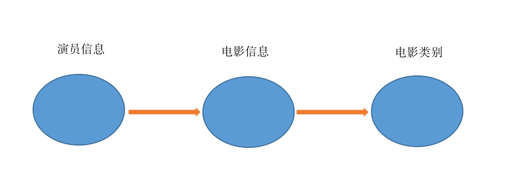
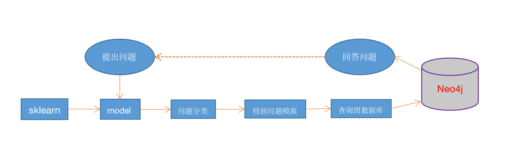

# 基于知识图谱的电影问答系统

#### 相关源代码GitHub上也有：

[https://github.com/xiaoliang8006/Movie-QA-System](https://github.com/xiaoliang8006/Movie-QA-System)

#### 体验地址：

[http://104.224.145.185:5000](http://104.224.145.185:5000)

此项目旨在构建一个关于电影的知识图谱问答系统。目前知识库本身的内容并不全面，但是麻雀虽小，五脏俱全，该项目对多种类型的问题形式都能得到正确的相应结果。以“李连杰”为例，本系统能够回答晴李连杰的个人简介，参演过的电影，参演过的电影类型，参演某一类型的电影都有什么。还能查询某个电影的信息，如上映时间，评分，类型，演员列表等等....

---

提供的功能有：

* 中文分词
* 词性标注
* 命名实体识别
* 知识图谱关系抽取
* 关键词提取
* 等等....

---

## 目录
* [搭建环境](#搭建环境)
* [使用方式](#使用方式)
* [思路](#思路)
* [代码说明](#代码说明)
* [评价](#评价)
* [附录](#附录)


## 搭建环境

#### python3.6 + jdk1.8 + neo4j-3.4.13

注意： neo4j-3.4.13要求java版本必须在jdk8以上

网页显示采用flask-0.12.2框架， 和neo4j数据库连接时用的是py2neo-3.0, 之前用py2neo-4.0总是容易出错。

## 使用方式

 先安装依赖:

    pip install -r requirements.txt

注意依赖包版本最好和requirements.txt一致或者不要相差太大，不然容易出错。然后运行服务器:

    python server.py

最后打开浏览器进入`http://127.0.0.1:5000`即可进行问答。

目前本系统可以回答类似如下类型的问题(以李连杰和警察故事为例)：

	1.警察故事的评分是多少
	2.警察故事的上映时间
	3.警察故事是什么类型的电影
	4.警察故事的主要情节
	5.警察故事中的演员都有谁
	6.李连杰的简介
	7.李连杰演过的动作电影有哪些
	8.李连杰演过哪些电影
	9.李连杰演的电影评分在7以上的都有哪些
	10.李连杰演的电影评分低于7的都有哪些
	11.李连杰演过的电影类型有哪些
	12.李连杰和章子怡一起演过哪些电影
	13.李连杰演过多少部电影
	14.李连杰生日是什么时候


## 思路




## 代码说明

#### data文件夹

&nbsp;&nbsp;&nbsp;&nbsp;首先是数据的准备，利用爬虫从维基和豆瓣上爬取电影数据及演员数据，这里我直接把数据预处理的结果放入了data文件夹

#### questions文件夹

&nbsp;&nbsp;&nbsp;&nbsp;放的是关于问题分类的训练数据

#### data2neo4j.py

&nbsp;&nbsp;&nbsp;&nbsp;将data文件夹下csv文件导入neo4j数据库。注意这里我放上了我的服务器，可以直接用。你也可以用data2neo4j.py将数据导入到自己的本地服务器，并在question_template.py修改地址即可。

&nbsp;&nbsp;&nbsp;&nbsp;import文件夹是neo4j默认的数据导入文件夹，所以首先要将data文件夹下所有csv文件拷贝到neo4j数据库的根目录import文件夹下，没有则先创建import文件夹，然后运行此程序。

#### question_classification.py

&nbsp;&nbsp;&nbsp;&nbsp;对问题进行分类

#### question_template.py

&nbsp;&nbsp;&nbsp;&nbsp;连接数据库，生成查询语句，返回结果

#### process_question.py

&nbsp;&nbsp;&nbsp;&nbsp;分类并回答问题

#### static文件夹

&nbsp;&nbsp;&nbsp;&nbsp;放的是关于前端显示的静态文件

## 评价

随机生成了30个问题，发现问题分类的准确率在90%左右，可能是因为训练样本较少的缘故。然后问题回答的准确取决于数据库中有无数据，如果分类正确而且数据库中有相关数据，基本都能正常返回答案。后续工作需要增加问题分类的训练样本和补充数据库资源....


## 附录
1.词性标注说明

```text
n　　　普通名词
nt　 　时间名词
nd　 　方位名词
nl　 　处所名词
nh　 　人名
nhf　　姓
nhs　　名
ns　 　地名
nn 　　族名
ni 　　机构名
nz 　　其他专名
v　　 动词
vd　　趋向动词
vl　　联系动词
vu　　能愿动词
a　 　形容词
f　 　区别词
m　 　数词　　
q　 　量词
d　 　副词
r　 　代词
p　　 介词
c　 　连词
u　　 助词
e　 　叹词
o　 　拟声词
i　 　习用语
j　　 缩略语
h　　 前接成分
k　　 后接成分
g　 　语素字
x　 　非语素字
w　 　标点符号
ws　　非汉字字符串
wu　　其他未知的符号
```

2.命名实体说明（采用BIO标记方式）

```text
B-PER、I-PER   人名
B-LOC、I-LOC   地名
B-ORG、I-ORG   机构名
```
